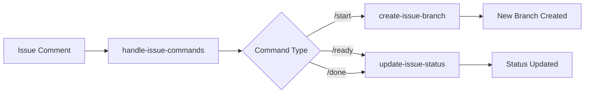

# Atriumn GitHub Actions Documentation

This directory contains comprehensive documentation for the Atriumn GitHub Actions repository.

## Documentation Index

### Getting Started
- **[Development Guide](./development.md)** - Set up your development environment
- **[Setup Guide](./SETUP.md)** - Configure repository settings
- **[Repository Settings](./repository-settings.md)** - Required repository settings
- **[Release Process](./releases.md)** - How to create and manage releases

### Available Actions

#### Issue Management
1. **[handle-issue-commands](../handle-issue-commands/README.md)** - Process slash commands in comments with authorization (Implemented)
2. **[create-issue-branch](../create-issue-branch/README.md)** - Create standardized issue branches with timestamp naming (Implemented)
3. **[update-issue-status](../update-issue-status/README.md)** - Update issue status via GraphQL API (Implemented)

#### Development Tools
1. **[setup-node](../.github/actions/setup-node/README.md)** - Configure Node.js environment

## Architecture Overview

### Issue Management Workflow

### Action Integration

These composite actions work together to create an automated development workflow:

1. **Issue Creation**: Developer creates an issue describing work
2. **Start Work**: `/start` command triggers branch creation
3. **Development**: Work proceeds on feature branch
4. **Status Updates**: Commands update issue status throughout
5. **Completion**: PR merged and issue closed automatically

## Best Practices

### Action Design
- Keep actions focused on a single responsibility
- Provide clear, descriptive names
- Document all inputs and outputs
- Include usage examples
- Add comprehensive error handling

### Testing
- Write tests for all new actions
- Use GitHub Actions workflow files for testing
- Test both success and failure scenarios
- Validate input handling

### Documentation
- Keep README files up to date
- Include practical examples
- Document any limitations
- Provide troubleshooting guidance

## Contributing

See our [Contributing Guide](../CONTRIBUTING.md) for details on:
- Setting up your development environment
- Creating new actions
- Testing requirements
- Pull request process

## Support

- **Issues**: [GitHub Issues](https://github.com/atriumn/atriumn-github-actions/issues)
- **Discussions**: [GitHub Discussions](https://github.com/atriumn/atriumn-github-actions/discussions)
- **Documentation**: You are here!
